# BiCycleL

**Second-hand bike marketplace for the Netherlands.**
Live at [bicyclel.nl](https://bicyclel.nl).

Sellers list bikes, buyers browse and chat in real time, and after a sale completes the buyer can leave a verified review. Built on the MERN stack with Socket.IO for live messaging and notifications.

---

## Screenshots

### Desktop

<table>
  <tr>
    <td>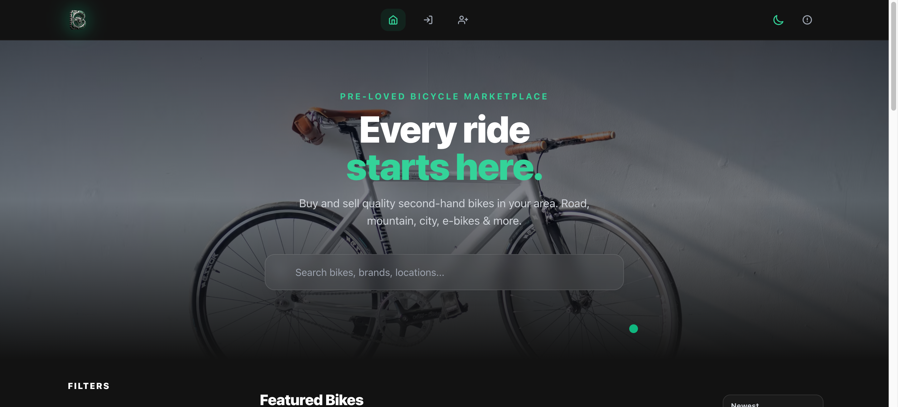</td>
    <td>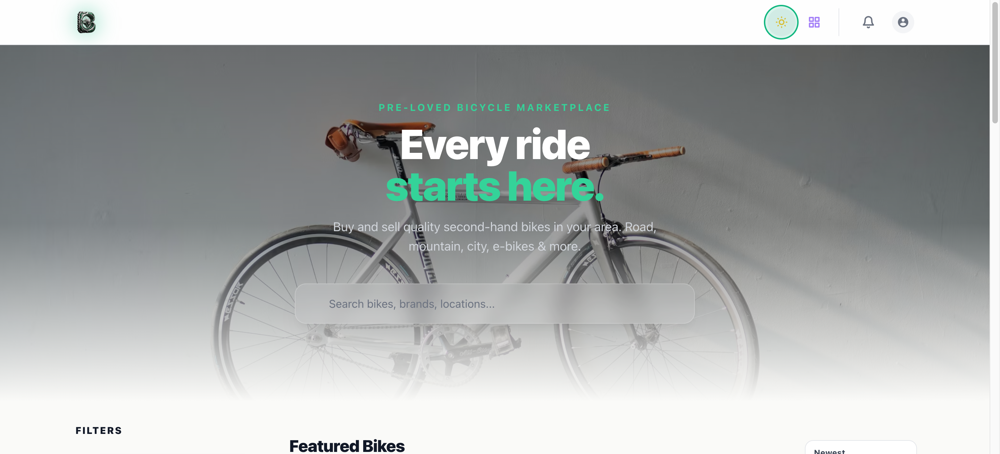</td>
  </tr>
  <tr>
    <td align="center"><em>Marketplace — dark mode</em></td>
    <td align="center"><em>Marketplace — light mode</em></td>
  </tr>
  <tr>
    <td>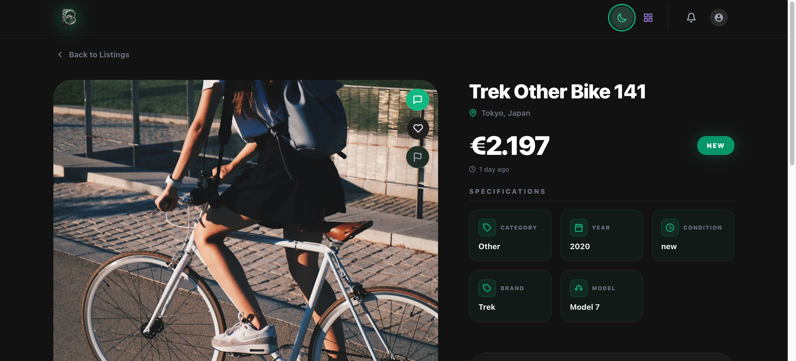</td>
    <td>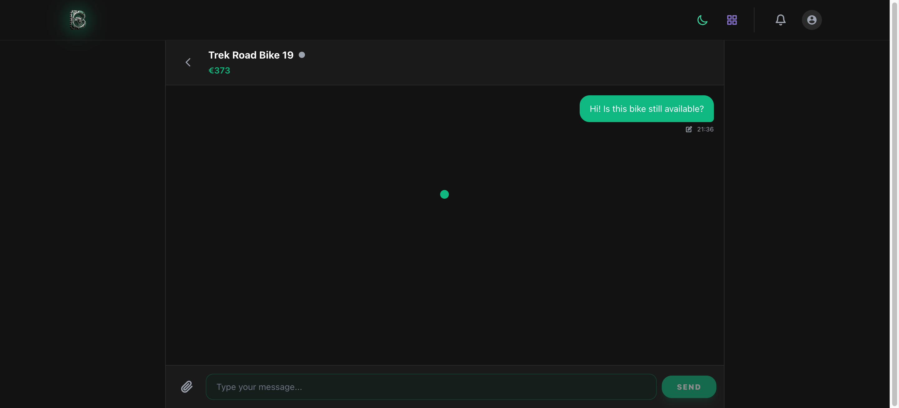</td>
  </tr>
  <tr>
    <td align="center"><em>Listing detail — photo carousel, specs, map</em></td>
    <td align="center"><em>Real-time messaging</em></td>
  </tr>
  <tr>
    <td>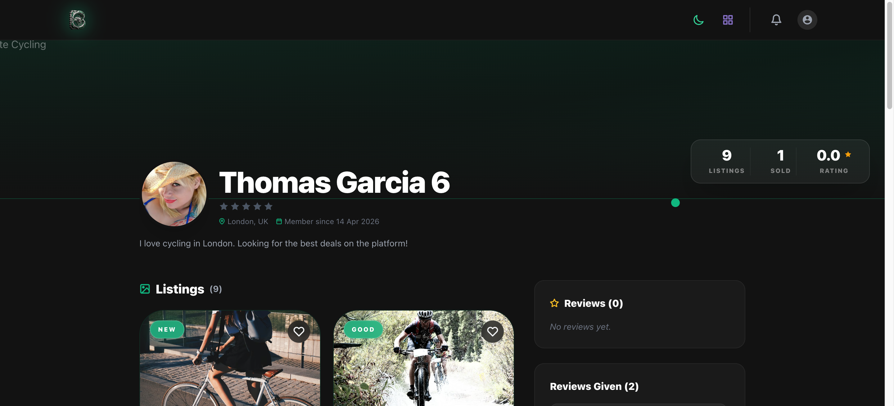</td>
    <td>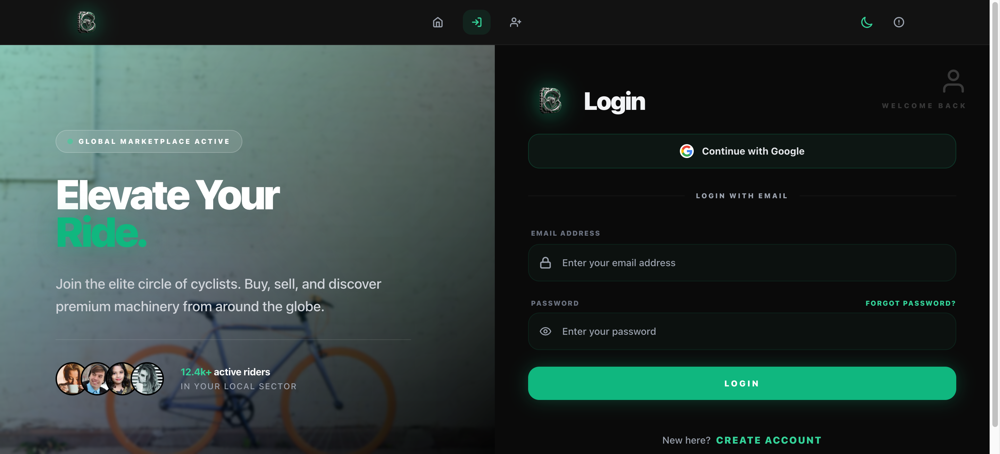</td>
  </tr>
  <tr>
    <td align="center"><em>Seller profile — listings and reviews</em></td>
    <td align="center"><em>Login — local auth and Google OAuth</em></td>
  </tr>
  <tr>
    <td>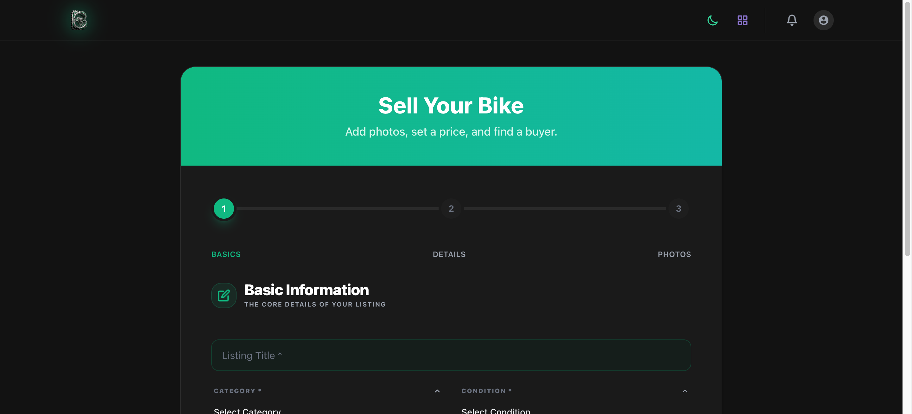</td>
    <td>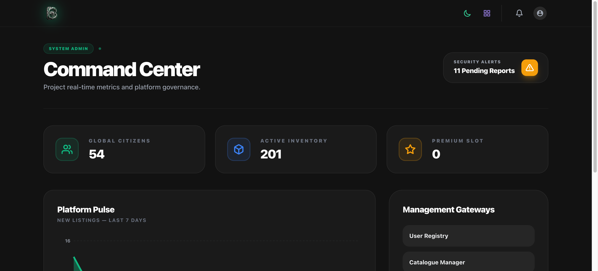</td>
  </tr>
  <tr>
    <td align="center"><em>Create listing — multi-step form</em></td>
    <td align="center"><em>Admin dashboard — platform stats</em></td>
  </tr>
  <tr>
    <td>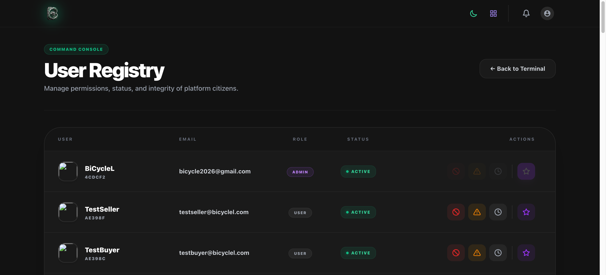</td>
    <td>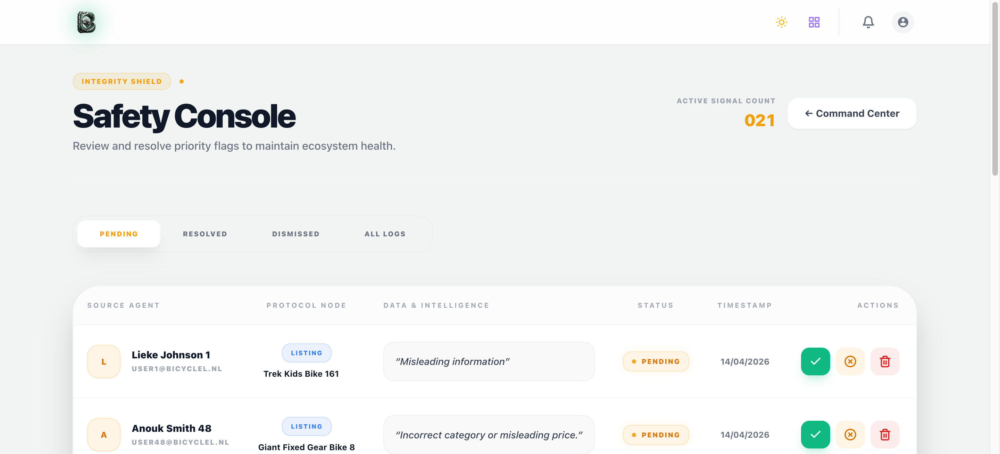</td>
  </tr>
  <tr>
    <td align="center"><em>Admin — user management</em></td>
    <td align="center"><em>Admin — report queue</em></td>
  </tr>
</table>

### Mobile

<table>
  <tr>
    <td>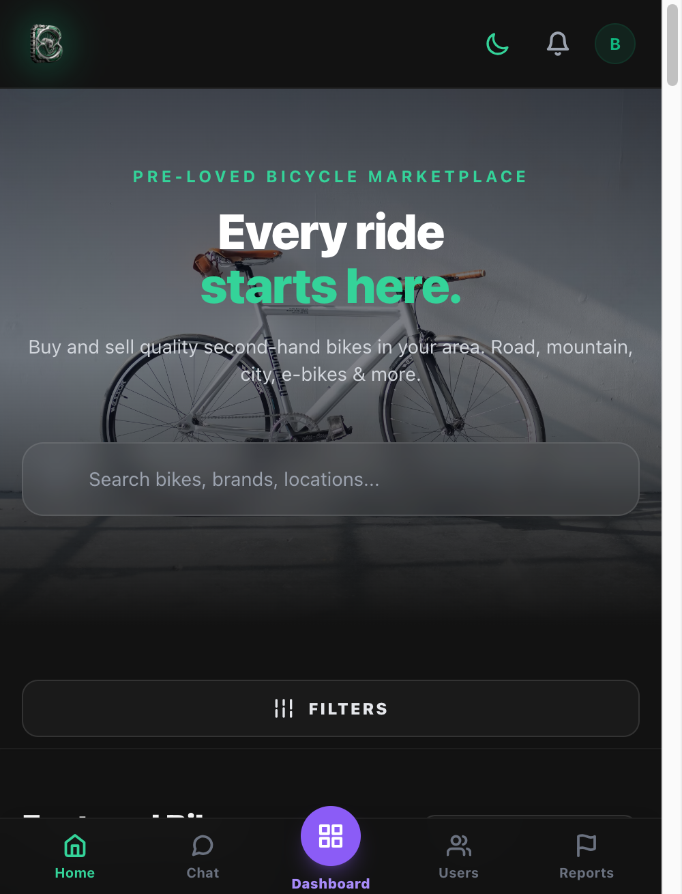</td>
    <td>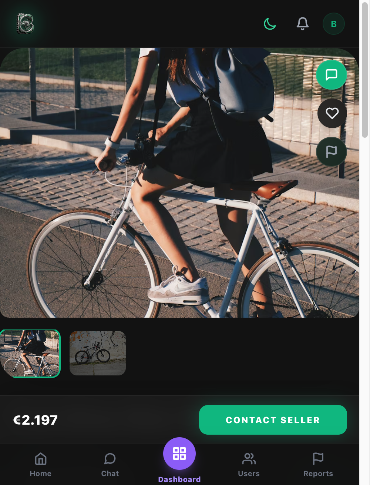</td>
    <td>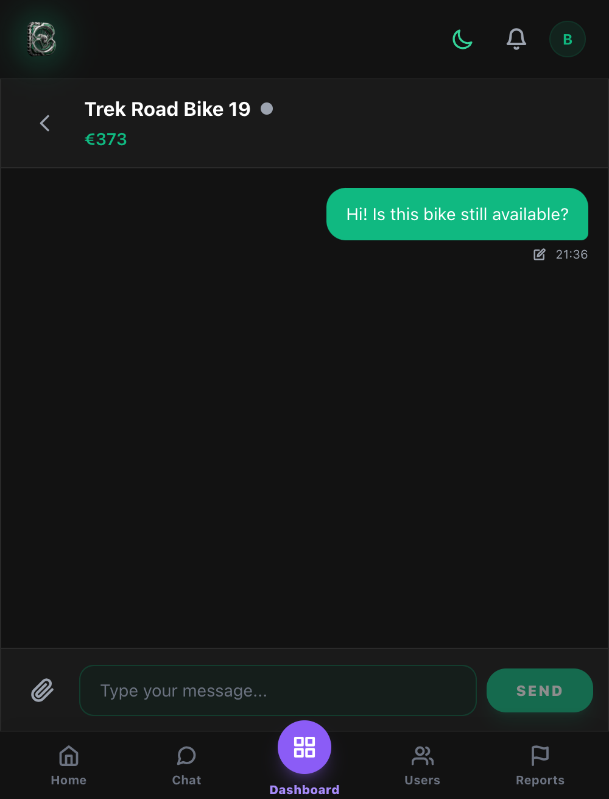</td>
    <td>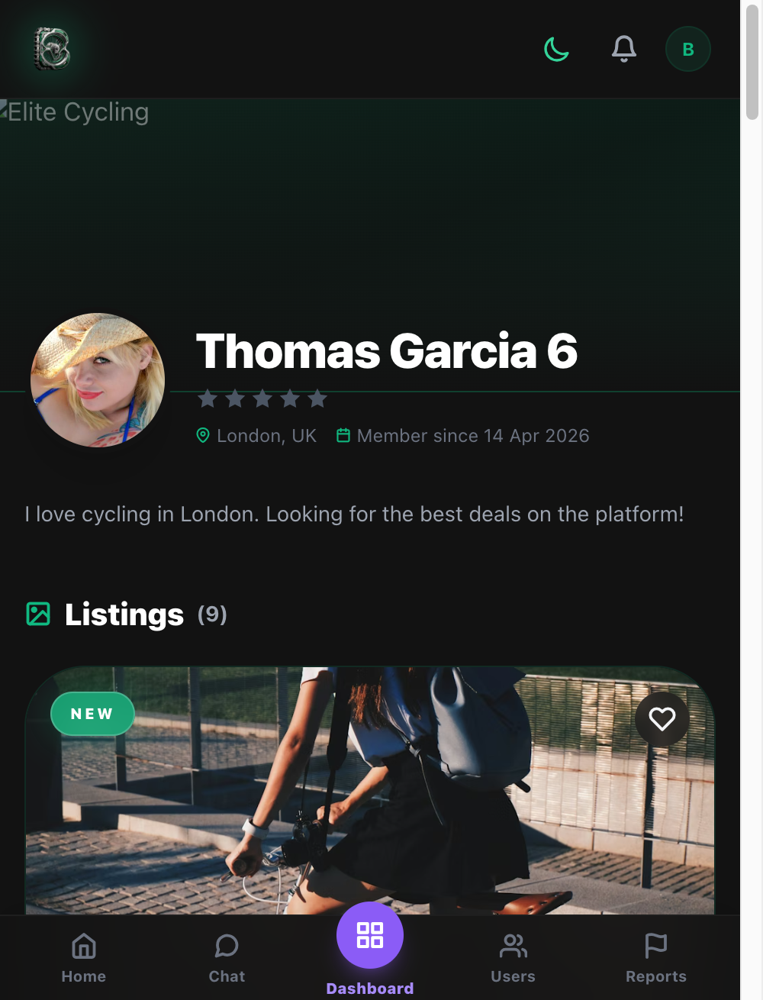</td>
    <td>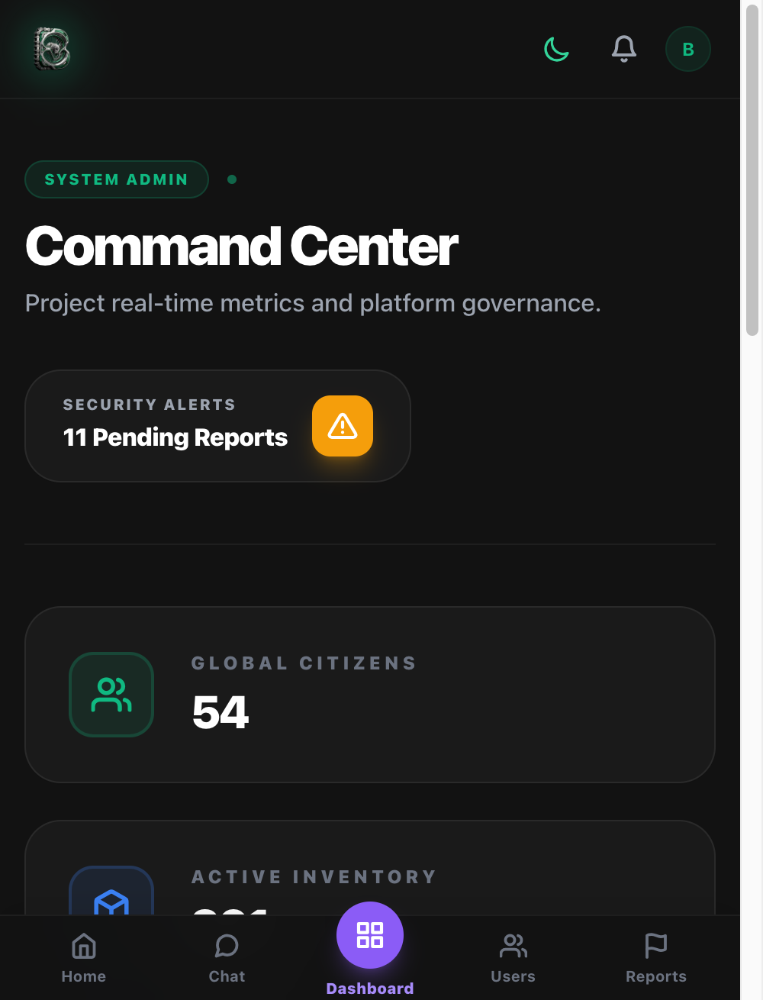</td>
  </tr>
  <tr>
    <td align="center"><em>Home</em></td>
    <td align="center"><em>Listing detail</em></td>
    <td align="center"><em>Chat</em></td>
    <td align="center"><em>Profile</em></td>
    <td align="center"><em>Admin</em></td>
  </tr>
</table>

---

## Tech Stack

| Layer | Technology |
|---|---|
| Frontend | React 19, Vite 7, Tailwind CSS 3, React Router 7 |
| Backend | Node.js 20, Express 5 |
| Database | MongoDB Atlas, Mongoose 9 |
| Real-time | Socket.IO 4 |
| Auth | JWT (httpOnly cookies), Google OAuth |
| Maps | Leaflet + React Leaflet, OpenStreetMap / Nominatim |
| Media | Cloudinary |
| Email | Resend |
| Testing | Jest, React Testing Library, Cypress |

---

## Getting Started

**Install dependencies** (root, client, and server in one command):

```bash
npm install && npm run setup
```

**Configure environment variables:**

```bash
cp server/.env.example server/.env
cp client/.env.example client/.env
```

Fill in the required values — see [Deployment Guide](docs/DEPLOYMENT.md) for the full variable reference.

**Start in development mode:**

```bash
npm run dev
```

This starts the Express server and Vite dev server concurrently. Vite proxies `/api` requests to the server on port 3000.

---

## Features

**Marketplace**
- Browse, search, and filter listings by location, price range, brand, and category
- Interactive map on each listing with a draggable pin for location selection when creating
- Image upload with in-browser crop support via Cloudinary (up to 5 images per listing)
- Listing lifecycle: active → sold, with buyer selection and buyer lock

**Messaging**
- Real-time chat scoped to a specific listing
- Typing indicators, online status, image sharing, and location sharing in chat
- Inbox with unread counts, bulk delete, and mark-all-read

**Reviews**
- Buyers recorded as the buyer of a sold listing can leave a one-time verified review
- Edit and delete — seller aggregate rating updates automatically
- Seller receives a real-time notification when a review is posted

**Accounts**
- Local auth (email + password) and Google OAuth
- Email verification on signup, password reset with 6-digit code
- Avatar upload with crop, notification preferences
- Change password, change email (with re-verification), delete account

**Admin**
- Dashboard with platform stats and activity graph
- User management: role changes, block/unblock, manual verification, warnings
- Listing moderation: featured toggle, force delete
- Report management: review and resolve user-submitted flags

---

## Project Structure

```
.
+-- client/          React app (Vite)
+-- server/          Express API
+-- cypress/         End-to-end tests
+-- docs/            Architecture, API reference, database schema, deployment guide
+-- .github/         CI workflows
```

---

## Scripts

| Command | Description |
|---|---|
| `npm run dev` | Start both servers in watch mode |
| `npm run build:client` | Build the React app for production |
| `npm run test` | Run Jest test suites (client + server) |
| `npm run code-style-check` | Run ESLint on client and server |

---

## Documentation

- [Architecture Overview](docs/ARCHITECTURE.md)
- [API Reference](docs/API.md)
- [Database Schema](docs/DATABASE.md)
- [Tech Stack Details](docs/TECH_STACK.md)
- [Deployment Guide](docs/DEPLOYMENT.md)

---

Developed as part of the HackYourFuture curriculum.
