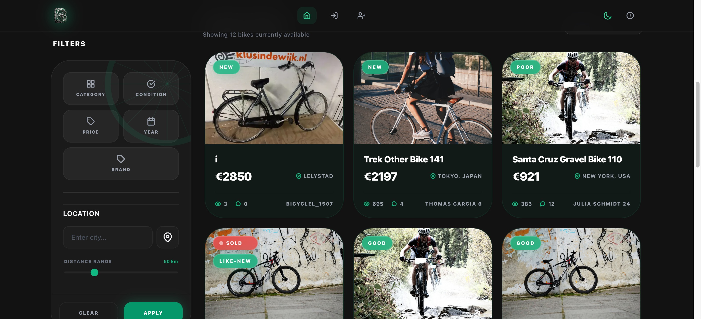
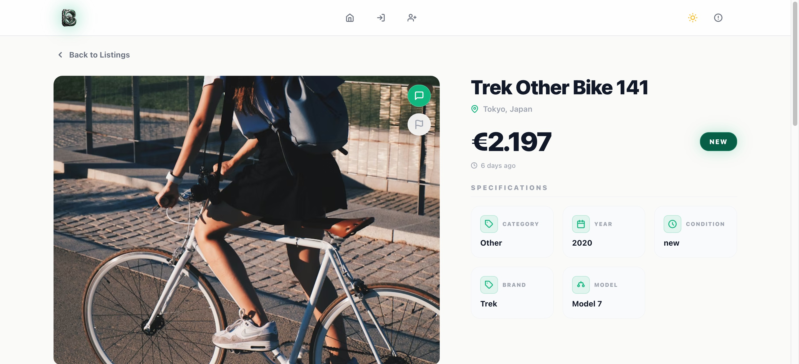
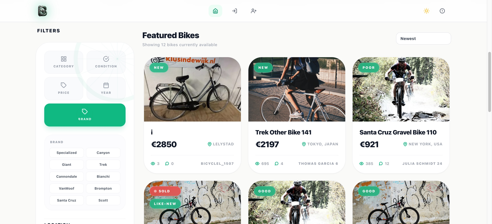
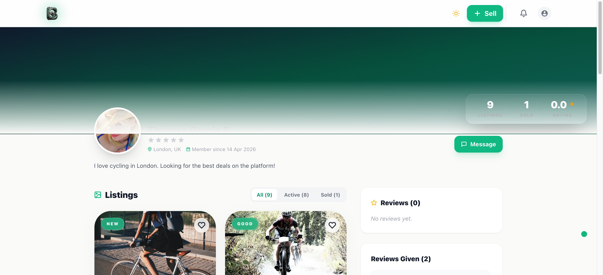
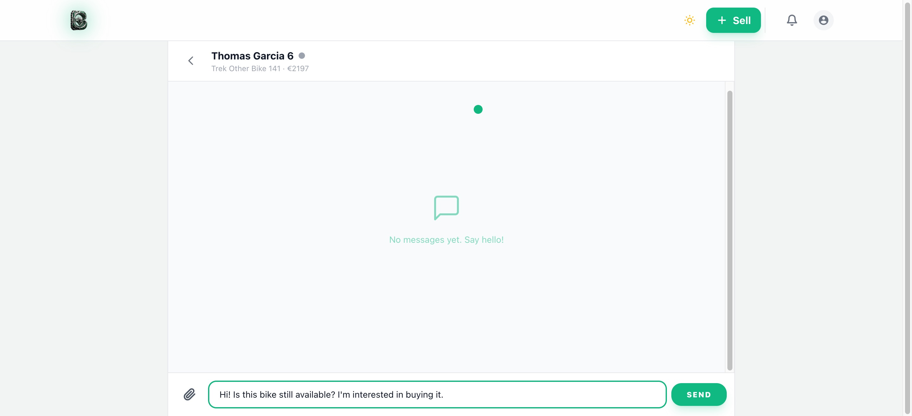
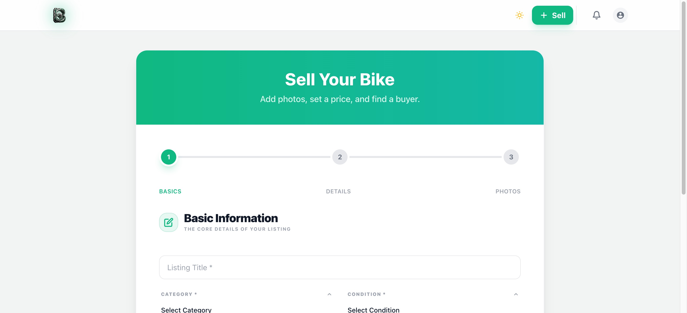
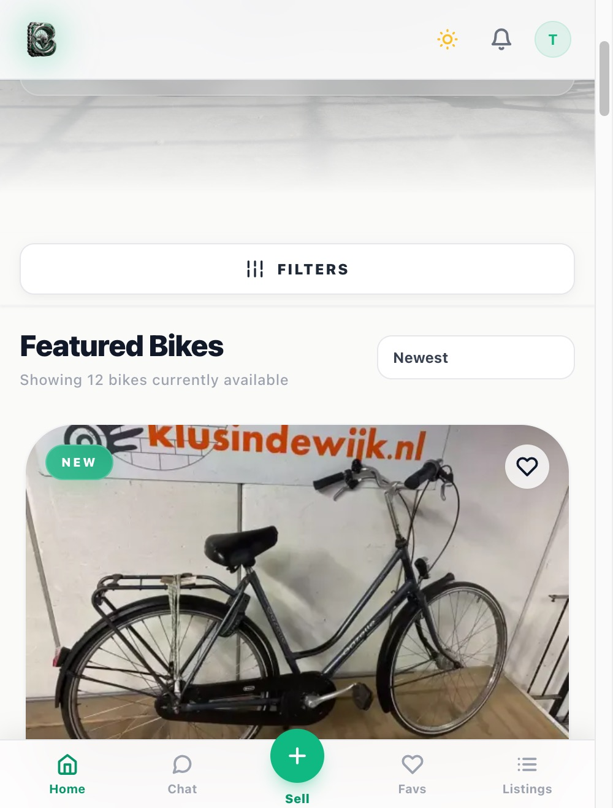
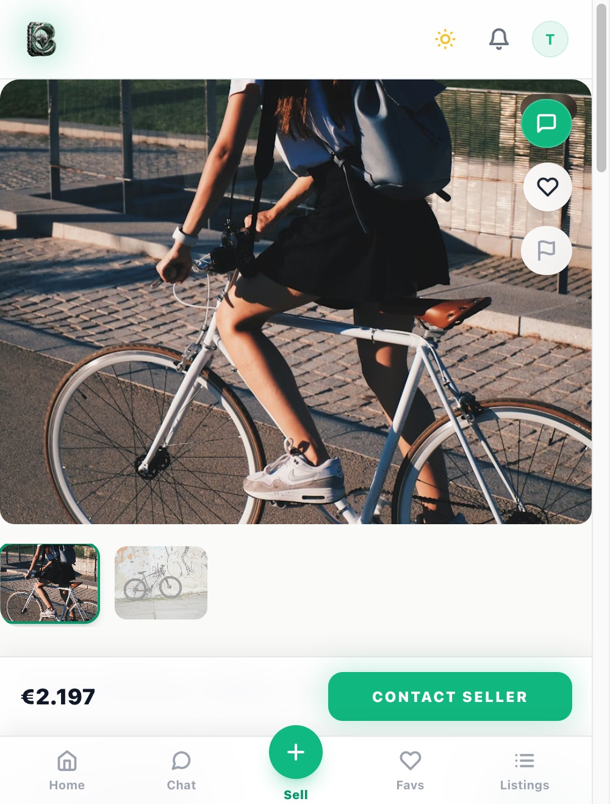
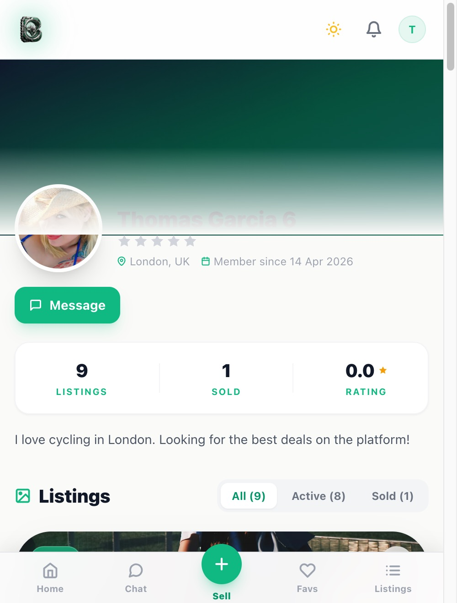
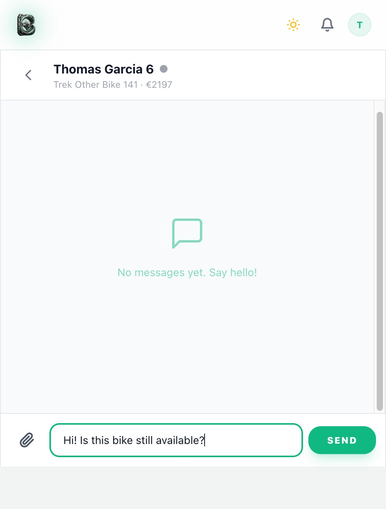

# BiCycleL - Premium Second-Hand Bike Marketplace


BiCycleL is a community-driven marketplace for high-quality second-hand bikes in the Netherlands. Built with the MERN stack, this platform features dynamic search, real-time messaging via WebSockets, and a modern responsive interface.

This project was developed as part of the HackYourFuture curriculum using Agile methodologies.

[Live Application](https://bicyclel.nl)

## Features

- **Real-time Chat**: Socket.IO powered messaging with JWT auth, per-conversation partner name in header, message soft-delete, and Cmd+Enter shortcut.
- **Advanced Search & Filters**: Category, condition, price range, model year, brand, and location-based filtering with distance radius. Brand filter covers 10 major manufacturers.
- **Listing Detail**: Multi-image carousel with `1 / N` counter badge, similar bikes strip (same category), share button (Web Share API + clipboard fallback), and dynamic OG/Twitter meta tags per listing.
- **Sold Listings**: Dedicated "See Similar Bikes" CTA on sold listing pages for non-owners.
- **Profile Pages**: Dynamic gradient banner, stats (listings/sold/rating), All/Active/Sold listing tabs, Message and Share buttons.
- **Security**: NoSQL injection protection, global rate limiting, and secure RESTful middleware with httpOnly JWT cookies.
- **Responsive Design**: Unified navigation system optimized for both mobile and desktop with bottom tab bar on mobile.
- **Admin Panel**: User management with bulk block/unblock actions, listing moderation, and platform-wide analytics.

## Screenshots

### Desktop

| Home (Dark) | Listing Detail | Brand Filter |
|---|---|---|
|  |  |  |

| Profile | Real-time Chat | Create Listing |
|---|---|---|
|  |  |  |

### Mobile

| Home | Listing Detail | Profile | Chat |
|---|---|---|---|
|  |  |  |  |

## Project Setup

To initialize the project and install all dependencies:

```bash
npm install
npm run setup
```

The `setup` command automatically installs dependencies for both the `client` and `server` directories.

### Environment Configuration

1. Create a `.env` file in both the `client` and `server` directories by copying their respective `.env.example` templates.
2. Configure the required environment variables (MongoDB URI, JWT secrets, API keys).

### Development Mode

To start the application in development mode:

```bash
npm run dev
```

## Documentation

Comprehensive documentation is available in the `docs` directory:

- [Architecture Overview](docs/ARCHITECTURE.md)
- [API Reference](docs/API.md)
- [Database Schema](docs/DATABASE.md)
- [Deployment Guide](docs/DEPLOYMENT.md)
- [Tech Stack Details](docs/TECH_STACK.md)

## Tech Stack

- **Frontend**: React 19, Vite 7, Tailwind CSS 3, TanStack Query v5
- **Backend**: Node.js 20, Express.js 5
- **Database**: MongoDB Atlas, Mongoose 9
- **Real-time**: Socket.IO 4
- **Testing**: Jest, Cypress

## Deployment

The frontend is deployed on **Vercel** and the backend is deployed on **Render**. Both services auto-deploy on pushes to the `main` branch. For detailed instructions, please refer to the [Deployment Guide](docs/DEPLOYMENT.md).
