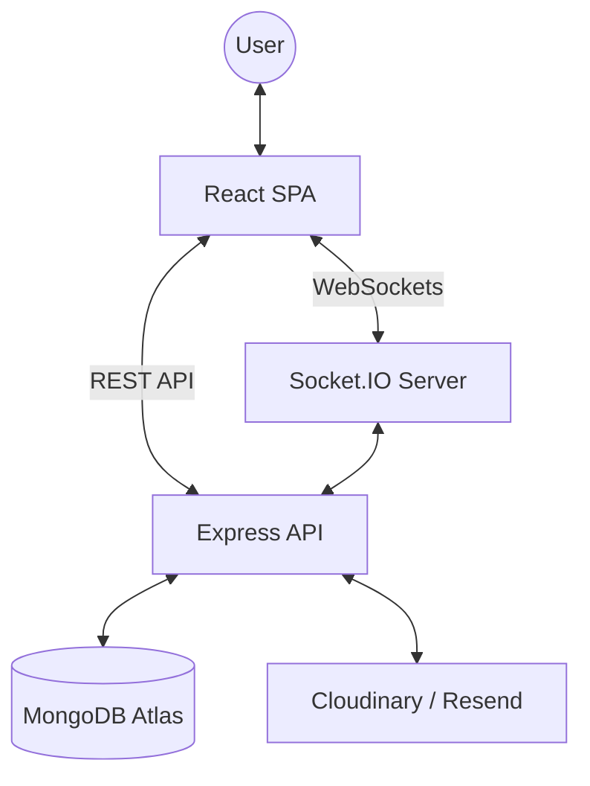

# BiCycleL Architecture Overview

BiCycleL is built using the MERN stack (MongoDB, Express, React, Node.js), following a modern client-server architecture with real-time data synchronization.

## System Architecture

## Frontend Architecture

The frontend is a single-page application (SPA) built with React and Vite. It utilizes a provider-based pattern for global state management.

- **Routing**: Managed by React Router v7 with role-based access control.
- **State Management**: Context Providers handle Authentication, Theme, Notifications, and Real-time Sockets.
- **Real-time Sync**: The `NotificationProvider` listens for server-side socket events (`new_notification`, `notifications_updated`) to update the UI instantly without page refreshes.
- **API Layer**: Centralized custom hooks (`useApi`) ensure consistent error handling and authentication header management.

## Backend Architecture

The backend is a Node.js Express server designed for scalability and security.

- **Authentication**: Stateless JWT-based authentication using `httpOnly` secure cookies for CSRF protection.
- **Socket.IO Integration**: Integrated into the HTTP server to share the same authentication context. It manages real-time chat, typing indicators, and account-wide notification broadcasts.
- **Security Middleware**: Includes global rate limiting, helmet for secure headers, and NoSQL injection sanitization.
- **Business Logic**: Controllers are modularized by domain (Listings, Users, Messages, Notifications).

## Real-time Notification Flow

1. **Trigger**: An event occurs (e.g., a new message is sent).
2. **Server Action**: The server saves the message and creates a notification record in MongoDB.
3. **Socket Broadcast**: The `socketHandler` identifies the recipient and emits a `new_notification` event to their specific private room (`user_${userId}`).
4. **Client Update**: The client-side `NotificationProvider` receives the event and updates the unread count and notification dropdown in real-time.

## Deployment Strategy

- **Production Build**: The React application is compiled into static assets and served by the Express server in production.
- **Hosting**: Deployed on Heroku with automatic builds triggered by Git pushes.
- **Infrastructure**: Uses MongoDB Atlas for managed database state and Cloudinary for optimized media delivery.

---

## Related Documentation

- [API Reference](./API.md)
- [Database Schema](./DATABASE.md)
- [Tech Stack Details](./TECH_STACK.md)
