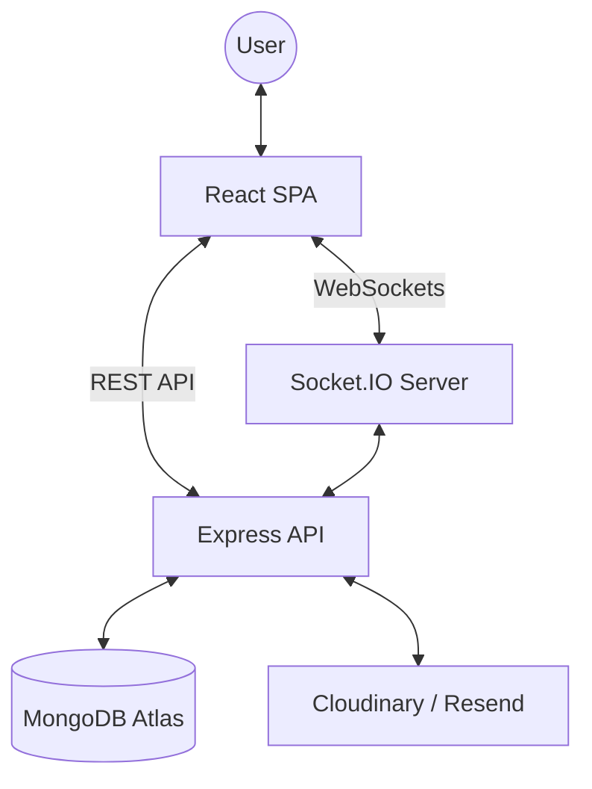

# BiCycleL Architecture Overview

BiCycleL is a MERN stack application with a client-server architecture and real-time communication over WebSockets.

## System Diagram

---

## Frontend

The frontend is a single-page application built with React 19 and Vite 7.

**Routing**
- React Router 7 handles all navigation
- Three route guard wrappers: `ProtectedRoute` (auth required), `PublicOnlyRoute` (redirects logged-in users), `AdminRoute` (admin role required)

**Global State**
- Five context providers, each scoped to a single concern:
  - `AuthContext` — current user, login/logout, session refresh
  - `ThemeContext` — dark/light mode with localStorage persistence
  - `ToastContext` — app-wide toast notification queue
  - `SocketProvider` — Socket.IO client instance, shared across the app
  - `NotificationContext` — unread count and notification list, updated in real time via socket

**Data Fetching**
- `useFetch` — callback-based hook for data that loads on component mount (listings, profiles, reviews)
- `useApi` — promise-based hook for imperative calls (form submissions, status updates, review actions)

---

## Backend

The backend is a Node.js 20 / Express 5 server, running as a single process with the HTTP server and Socket.IO server sharing the same port.

**Authentication**
- Stateless JWT stored in an `httpOnly` `Secure` cookie — no token stored in client memory
- `authenticate` middleware validates the cookie on every protected route
- `requireVerified` middleware blocks unverified accounts from creating or editing listings
- `requireOwnership` middleware factory used on update/delete routes to enforce resource ownership

**Socket.IO**
- The `io` instance is attached to the Express app (`app.set("io", io)`) so controllers can emit events
- Each authenticated user joins a private room: `user_{userId}` — used for targeted notification delivery
- Chat rooms follow the format `{listingId}_{userId1}_{userId2}` — deterministic, collision-free
- Security check on `send_message`: server verifies the sender is actually a participant in the room

**Security Middleware Stack**
- Helmet 8 — sets Content Security Policy, CORP, COOP, and other secure headers
- CORS — origin list shared between Express and Socket.IO via `config/allowedOrigins.js`
- `express-rate-limit` — global limit on all `/api` routes, stricter limit on sensitive operations (verify, reset)
- `express-validator` — validation rules defined as route middleware, not inside controllers

---

## Review Flow

The review system is intentionally gated through the full transaction lifecycle:

1. Buyer sends a message from the listing page — the message is saved with `listingId` in the database
2. Seller opens "Mark as Sold" — server queries `Message` collection to find all users who chatted about that listing, presents them as candidates
3. Seller selects the buyer and confirms — `listing.buyerId` is set and locked (cannot be changed to a different user)
4. Server emits a `review_permission` notification to the buyer
5. Buyer visits the listing — `canRate` is true when `user._id === listing.buyerId` and `listing.status === "sold"` and the user has not already reviewed
6. Buyer submits a review — server re-validates all three conditions before saving

---

## Real-time Notification Flow

1. An event occurs server-side (new message, review posted, listing sold, etc.)
2. The controller saves a `Notification` document to MongoDB
3. `emitNotification(recipientId, notification)` is called — this emits to the recipient's private room
4. The client-side `NotificationContext` receives `new_notification` and appends it to the list, incrementing the unread count
5. When the user opens the notification dropdown, `notifications_updated` is emitted back to sync read state across tabs

---

## Production Build

In production, Express serves the compiled React app from `client/dist` as static files. There is no separate frontend server — everything runs on a single Heroku dyno.

---

## Related Documentation

- [API Reference](./API.md)
- [Database Schema](./DATABASE.md)
- [Tech Stack Details](./TECH_STACK.md)
